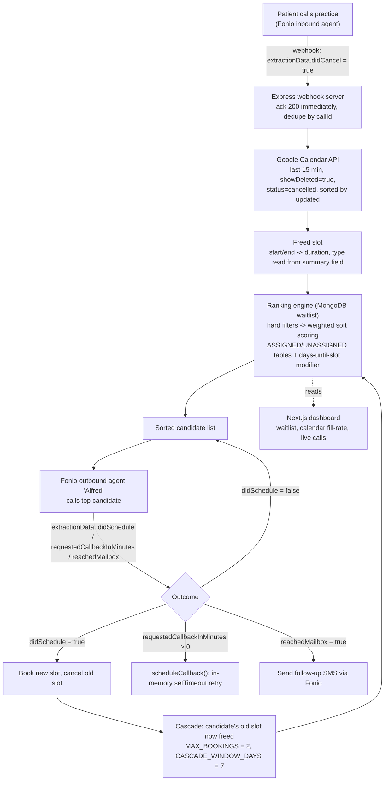

# Alfred

Alfred is an autonomous voice agent that fills cancelled dental appointment slots by calling through a ranked waitlist — built for the **Fonio** track at **Hack Vienna '26**.

A submission for Hack Vienna '26, built for the case provided by Fonio.

## About

Dental practices lose revenue every time a patient cancels last-minute, because refilling that slot usually means a receptionist working down a paper waitlist by hand. Alfred is an agent stack that takes, cancels and answers questions about appointments over the phone, detects the moment a cancellation frees up a calendar slot, and then autonomously calls through a ranked waitlist — by phone — until the slot is filled again. A companion web dashboard lets dental staff watch the calendar fill back up and follow the calls as they happen.

## The challenge

Fonio asked us to build a voice-agent solution for a real-world business problem using their conversational AI platform. We picked a dental practice as our target: when a patient cancels, the freed-up slot typically stays empty until someone manually works through a waitlist. Our goal was to close that loop end-to-end — detect the cancellation, rank the best-fit replacement patients, and have an AI agent call them, with no human in the loop.

## What we built

- **Inbound agent** that books, cancels, and answers questions about appointments over the phone, and reliably detects cancellations via Fonio's variable-extraction (no custom NLP pass needed)
- **Smart waitlist ranking** — a two-stage hard-filter + weighted soft-scoring system (urgency, proximity, history, fairness, …) that picks the best-fit candidate for each freed slot; full spec in [ranking.md](/ranking.md)
- **Outbound scheduling agent ("Alfred")** that calls candidates in ranked order, reads out old vs. new appointment slots, handles "call me back later", and falls back to SMS when it reaches voicemail
- **Cascade recovery** — booking a candidate into a freed slot frees up *their* old slot too, so we re-run the recovery loop on it (capped to avoid runaway call chains)
- **Web dashboard** for dental staff to see the waitlist ranking, watch calendar fill-rate (Google Calendar integration), and follow ongoing conversations live, including recordings

## Architecture



Full write-up of each stage — including the scoring formulas and known gaps — lives in [REPORT.md](/REPORT.md) and [ranking.md](/ranking.md).

## Demo

- Live (read-only) demo: [fonio.philippscheer.com](https://fonio.philippscheer.com) — dashboard with recorded calls and calendar view
- Recordings: [conversation-steffen-reschedule.mp4](/materials/conversation-steffen-reschedule.mp4) (Alfred reschedules a patient end-to-end), [reroute-human-compressed.mp4](/materials/reroute-human-compressed.mp4) (Alfred answers practice questions and reroutes to a human)
- Waitlist & ranking: [waitlist.png](/materials/waitlist.png), [waitlist-sara.png](/materials/waitlist-sara.png) — the ranked waitlist view and the rationale behind why a given patient is picked next
- Live transcripts: [transcript-overview.png](/materials/transcript-overview.png), [transcript-screenshot.png](/materials/transcript-screenshot.png) — call overview and live transcript in the web UI
- SMS fallback: [alfred-sms.jpeg](/materials/alfred-sms.jpeg) — Alfred's follow-up SMS after reaching voicemail
- Outbound call system prompt: [outbound-prompt.md](/materials/outbound-prompt.md)
- All of the above are also walked through with context in [REPORT.md → Demo](/REPORT.md#demo)

## Getting started

### Prerequisites

- [Node.js](https://nodejs.org/) (v20+) and npm
- A [MongoDB](https://www.mongodb.com/) instance (e.g. MongoDB Atlas)
- A [Fonio](https://fonio.ai/) account with an API key and a configured assistant
- A Google Cloud service account with read-only access to a Google Calendar (for the calendar integration)

### Setup

```bash
# 1. Clone the repository
git clone https://github.com/mateotejera04/Fonio.ai---hackathon fonio-hackathon
cd fonio-hackathon

# 2. Configure environment
# fill in the required values (see Configuration below)
# FONIO_API_KEY=xx
# MONGODB_URI=xx

# 3. Install dependencies
cd app && npm install
cd ../web && npm install
```

### Run

```bash
# Webhook server (handles Fonio webhooks, ranking, outbound calls)
cd app
npm run dev

# Web dashboard
cd web
npm run dev
```

Then open `http://localhost:3000` in your browser for the dashboard.

## Project structure

- [`app/`](/app) — Node.js/TypeScript/Express webhook server: receives Fonio cancellation webhooks, talks to Google Calendar, ranks the waitlist ([`src/ranking.ts`](/app/src/ranking.ts)), and triggers outbound calls
- [`web/`](/web) — Next.js/Shadcn/Tailwind dashboard for dental staff: waitlist view, calendar fill-rate, live conversations
- [`materials/`](/materials) — demo recordings, screenshots, and the outbound-call system prompt
- [`ranking.md`](/ranking.md) — full spec of the waitlist hard-filter and scoring algorithm, with formulas and a worked example
- [`REPORT.md`](/REPORT.md) — write-up of the architecture, design decisions, and known limitations

## Configuration

Document the following in your `.env` (never commit secrets — keep them in `.env`, which is git-ignored, and provide a `.env.example`):

| Variable | Purpose |
| --- | --- |
| `FONIO_API_KEY` | API key for the Fonio voice-agent platform (inbound/outbound calls, SMS) |
| `MONGODB_URI` | Connection string for the MongoDB instance backing the waitlist and call logs |
| `MONGODB_DB` / `MONGODB_CALLS_DB` | Database names for waitlist data and call records |
| `GOOGLE_CALENDAR_KEY_FILE` | Path to a Google service-account JSON key with read-only Calendar access (defaults to `.alfred.iam.json` if unset) |
| `PORT` | Port the webhook server listens on |

For deployment, also see [`docker-compose.prod.yml`](/docker-compose.prod.yml), which additionally expects `CLOUDFLARE_TUNNEL_KEY` for the Cloudflare tunnel.

## Architecture & assumptions

The webhook server is the brain: it receives Fonio call-completion webhooks, uses Fonio's inline variable extraction to detect cancellations and booking outcomes, cross-references the Google Calendar API to find the freed slot, ranks the waitlist ([ranking.md](/ranking.md)), and drives outbound calls — acknowledging every webhook with `200` immediately and processing asynchronously to avoid duplicate calls on retries. The Next.js dashboard reads the same MongoDB data to visualize the waitlist, calendar, and live conversations for dental staff.

We assumed the agent handles calls sequentially (so "most recently cancelled calendar event" reliably maps to the triggering call), and that a demo environment can route all outbound calls to a fixed number rather than patients' real contacts. See [REPORT.md](/REPORT.md#known-limitations--what-wed-improve-with-more-time) for the full list of known limitations and what we'd improve with more time.

## Troubleshooting

- **Webhook server can't connect to MongoDB** → double-check `MONGODB_URI` in `.env` and that your IP is allow-listed on the Atlas cluster
- **Calendar lookups return nothing / wrong event** → verify the service-account key path (`GOOGLE_CALENDAR_KEY_FILE`) and that the calendar is shared with the service account with at least read-only access
- **Outbound calls aren't firing** → confirm `FONIO_API_KEY` is valid and the Fonio assistant/phone number is correctly configured for the project

## Team

- Philipp Scheer — Backend & Agent Logic (Fonio)
- Mateo Tejera — Frontend & WebUI & User picking logic
- Tanay Tandon — LLMOps

## Submission

Track: Fonio · Case partner: Fonio
Submitted to the Hack Vienna '26 GitHub organisation.

## License

Released under the MIT License — see [LICENSE](/LICENSE).
