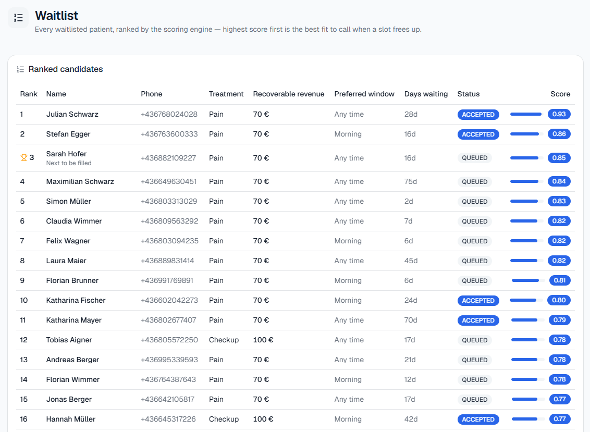
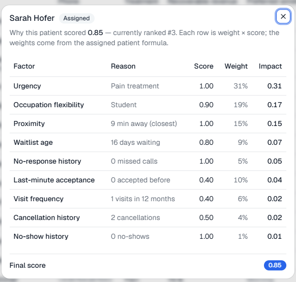
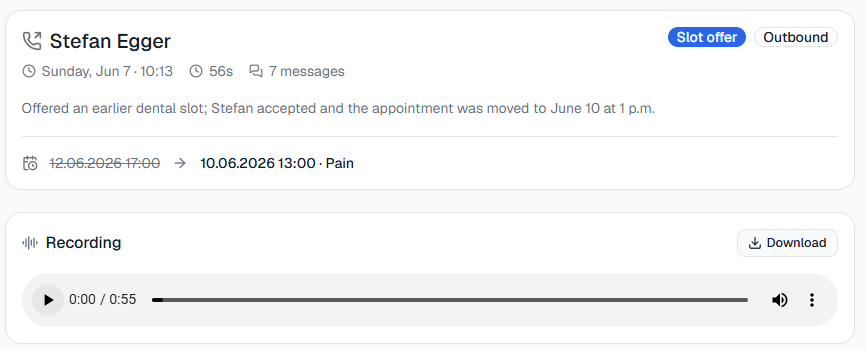
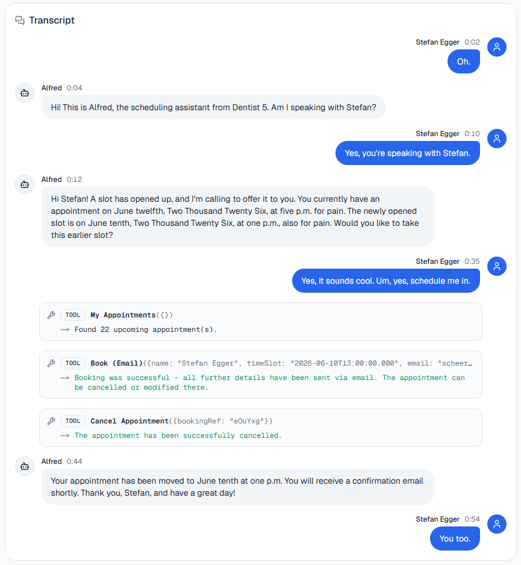
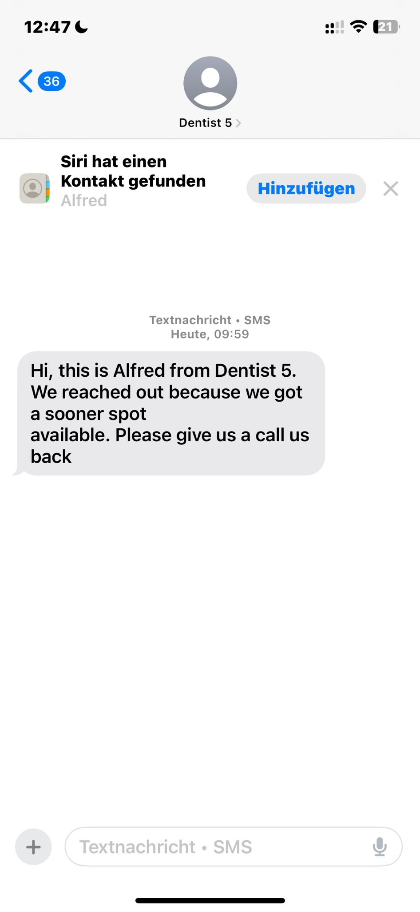

# Report - Fonio Track @ Hack Vienna

## Problem Framing

Dental practices lose revenue whenever a patient cancels last-minute and the slot stays empty — refilling it usually means a receptionist working down a paper waitlist by hand. We picked a dental praxis as our target and built an agent stack that (1) takes, cancels and answers questions about appointments over the phone, (2) detects the moment a cancellation frees up a calendar slot, and (3) automatically works through a ranked waitlist by phone — fully autonomously — until the slot is filled again.

## Solution overview

We decided to optimize for having strong logic when picking the right user for a reschedule call (details see [RANKING.md](/ranking.md)) and to give the analyst a rich experience (can talk about dentist information like appointment types, opening hours, price, etc... but also redirect to a human if possible). On top of this we built a webui for the staff at the dentist to keep track of their bookings and see which users are being currently booked.

### Inbound agent

The inbound agent handles booking an appointment, cancelling an appointment and getting information for the dentist.

#### How did we detect a cancellation?

Cancellations are detected through the Fonio API using the Variable Extraction Tool: a typed schema that Fonio fills in live from the conversation and ships straight in the `extractionData` field of the webhook payload — no extra parsing or inference step on our end. We first tried running our own LLM pass over the transcript after each call to classify cancellations, but Fonio's inline extraction proved both more reliable and simpler to operate, so we dropped our custom pass entirely.
The Variable extraction looks like this:

```json
{
  "didCancel": {
    "type": ["boolean", "null"],
    "description": "Did the user cancel his appointment? true if he cancelled his appointment, false if he booked an appointment or did anything else than cancel an appointment"
  }
}
```


#### What happens after a cancellation?

If the user decided to cancel an appointment, `didCancel` returns true very reliably. Once that happens, we query the Google Calendar API (authenticated via a service-account/IAM key, read-only scope) for everything updated in the **last 15 minutes** with `showDeleted: true`, filter down to events with `status: cancelled`, and take the one with the most recent `updated` timestamp. This relies on the assumption that the agent handles calls sequentially — we could not reliably map a specific Fonio call to a specific Google Calendar entry (no shared ID between the two systems), and solving that mapping properly turned out to be non-trivial within the hackathon timeframe, so "most recently cancelled" was our pragmatic stand-in.

From that calendar event we derive everything the recovery loop needs:

- Start and end time (the cancelled slot's duration is computed from the difference, in minutes)
- Event type, read straight from the calendar entry's summary field (Dental cleaning, Pain, Annual Checkup)

The event type is important so that we can pick a suited user from the waiting list that actually matches our event type (a user that wants an annual checkup won't get booked on an urgend pain case).

### Select the correct user

We treat candidate selection as a two-stage ranking problem (full spec with formulas and a worked example: [RANKING.md](/ranking.md)):

1. **Hard filters** drop anyone who can't or shouldn't be called for *this specific* slot: no call/message consent, wrong treatment type for the freed slot, can't physically arrive in time (`min(home_distance_min, work_distance_min) >= minutesUntilSlot`), already declined or already being contacted for this exact slot, or outside their preferred morning/afternoon window.
2. **Soft scoring** ranks everyone left from 0–1 across nine weighted variables — urgency of the freed slot's treatment type, proximity, occupation flexibility, last-minute-acceptance history, no-response/cancellation/no-show history, waitlist age, and visit frequency.

We run two different weight tables depending on whether the candidate already holds an appointment: `ASSIGNED` patients lean harder on urgency and proximity (they're only worth moving for a clearly better slot), while `UNASSIGNED` patients lean harder on waitlist age (fairness matters more when nothing is booked yet). On top of that, a **days-until-slot modifier** dynamically scales the proximity weight up the closer the slot gets — up to 2.5× inside a 2-hour window — and proportionally rescales every other weight so the formula still sums to 1.0. Candidates are then contacted strictly in descending score order.

### Outbound scheduling agent

For the outbound scheduling agent we created a new Fonio assistant and connected it with one of our phone numbers.
To be able to customize the outbound calls, we defined a custom system prompt with variables that allow for Name, Phone, Email and most importantly the old booking information and the new booking information. What we learnt is that if the assistant speaks the assistant dates out loud he is way more likely to book the correct slots.

The prompt we use can be found [here](/materials/outbound-prompt.md).

The outbound agent also uses the Fonio variable extraction like the following:

```json
{
  "didSchedule": {
    "type": ["boolean", "null"],
    "description": "Did the user accept the new appointment slot? true if he accepts the new appointment slot and it got booked correctly, false if he did not accept the new appointment slot or it could not get booked"
  },
  "requestedCallbackInMinutes": {
    "type": ["integer", "null"],
    "description": "only if the user explicitly asks for a call back fill in the minutes the user asks for (15 is default). if the user only agrees to the future call for open spots, this does not count as callback. use 0 in this case and any case where the user does not ask for a call back"
  },
  "reachedMailbox": {
    "type": ["boolean", "null"],
    "description": "true if the assistant reached the voicemail indicated by something like you reached the mailbox, leave a message after the beep. false, if talked to a human."
  }
}
```

The single parts:

- `didSchedule`: it's used to decide if it should call the second person from the list, eg. when the first one said "No", we're gonna take the second user from the waitlist
- `requestedCallbackInMinutes`: we decided that the user might be busy and wanted to catch the edge case when he tells us "Please call me back in 10 minutes". If this variable is returned, we're stopping the calling and schedule another call after the amount of minutes given
- `reachedMailbox`: if the assistant reaches the mailbox, it sends out an SMS telling the person to call us back for an appointment. For SMS sending we are also using the Fonio infrastructure (see [Demo](#demo) for a screenshot).

### Cascade — refilling the slot the new patient frees up

Accepting an offered slot doesn't just fill one gap, it opens another: the patient's *previous* slot is now empty too. We re-run the same recovery loop on it, capped at `MAX_BOOKINGS = 2` cascades and only if the freed slot starts within `CASCADE_WINDOW_DAYS = 7` days (otherwise we leave it open rather than re-offering something too far out):

```
Slot A cancelled → Patient X (top of waitlist) accepts Slot A
                 → X's old slot B is now free
                 → Patient Y (best match for B) gets called for B
```

This roughly doubles the slots we can recover from a single cancellation, for the cost of one extra outbound call.

### Webhook handling: ack first, process async

We answer every Fonio webhook with `200` immediately and run the actual `didSchedule` / `reachedMailbox` / cascade logic afterwards, plus we deduplicate retried deliveries by `callId` in a `processedCalls` set. This avoids the classic webhook failure mode where a slow handler causes the sender to retry the same event and the system ends up calling the same person twice or double-booking a slot.

---

## Demo

<details>
<summary>Recording: Alfred reschedules Steffen's appointment (mp4)</summary>

[conversation-steffen-reschedule.mp4](materials/conversation-steffen-reschedule.mp4)

</details>

<details>
<summary>Alfred answers questions about the dentist office and reroutes to a human</summary>


[reroute-human-compressed.mp4](materials/reroute-human-compressed.mp4)

</details>


<details>
<summary>Waitlist and understanding why the next person is going to be picked</summary>




</details>


<details>
<summary>Screenshots: live transcript & call overview in the web UI</summary>





</details>

<details>
<summary>Alfred sending a follow-up SMS after reaching voicemail</summary>



</details>

---

## Known limitations & what we'd improve with more time

- **Hard filters are only partially wired up.** Our [ranking spec](/ranking.md) defines six hard filters (consent, treatment-type match, arrival-time feasibility, already-rejected slot, already-being-contacted, time-window match). The live engine currently enforces `consent_call` (in the scoring stage) and `already_rejected_slots` (separately, when picking a candidate) — treatment-type match, arrival feasibility and time-window are not yet enforced. In the worst case the system could offer a "Cleaning" slot to someone who only wants "Pain"/urgent care, or call someone who can't physically make it in time. The scoring functions for these already exist on paper; wiring them into `applyHardFilters` is mechanical, it just didn't make it before the demo deadline.
- **The "old appointment" we read out is synthetic.** Because we never solved the Fonio↔Google-Calendar mapping problem (see above), the waitlist data has no real "current appointment" timestamp per patient. The backend hardcodes one of two placeholder datetimes selected by booking number, so the *old* slot Alfred mentions on a call is not the patient's actual booking. Fixing this means capturing and persisting a `current_appointment_datetime` per waitlist entry at intake.
- **Scheduling state lives in process memory.** Pending callbacks (`scheduleCallback`, timer-based) and the webhook idempotency set are both in-memory — a restart drops pending callbacks and can let a duplicate webhook through. Both belong in MongoDB-backed jobs for anything beyond a demo.
- **Calendar matching can race.** We pick the most-recently-*updated* cancelled event from the last 15 minutes of calendar history. Two cancellations close together could be matched to the wrong event, since nothing currently links a specific Fonio call to a specific calendar entry ID.
- **Outbound calls are routed to a fixed demo number/email** rather than the picked patient's real contact data, so the live demo always rings the same phone — intentional for safety during the hackathon, but worth knowing if you read the code expecting per-patient dialing.

